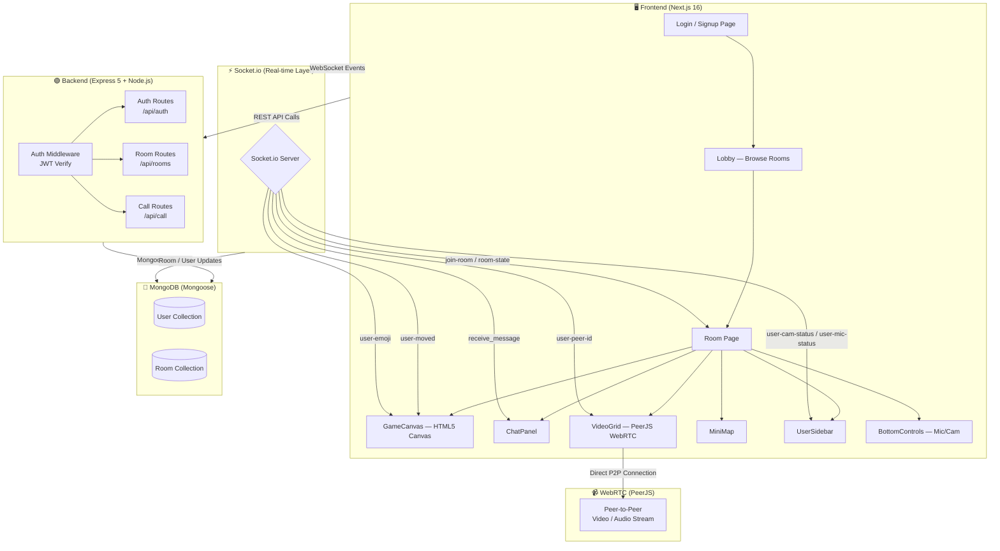

# 🌐 Metaverse 2D  [Live Link](https://metaverse-2d-ten.vercel.app/)

> A real-time, browser-based 2D virtual space where users can move avatars around a shared world, chat, react with emojis, and video call others nearby — all powered by WebSockets and WebRTC.

[](https://nextjs.org/)
[](https://nodejs.org/)
[](https://socket.io/)
[](https://mongodb.com/)
[](https://opensource.org/licenses/ISC)

---

## 📖 Description

**Metaverse 2D** is a collaborative virtual office / social space built entirely in the browser. Users sign up, pick an avatar, create or join rooms, and navigate a 2D tile-based world in real time. When avatars get close to each other, proximity-based video and voice calls are triggered automatically via WebRTC (PeerJS). A live chat panel, emoji reactions, mic/cam controls, a minimap, and a user sidebar round out the experience.

The project is split into two independent services:

| Layer | Technology |
|---|---|
| **Frontend** | Next.js 16, React 19, Tailwind CSS 4, Socket.io-client, PeerJS |
| **Backend** | Node.js, Express 5, Socket.io 4, Mongoose, JWT, bcrypt |
| **Database** | MongoDB (Atlas or self-hosted) |

---

## ✨ Features

- 🕹️ **2D Canvas World** — Tile-based room rendered on HTML5 Canvas with furniture (tables, sofas, plants, bookshelves, whiteboards)
- 🏃 **Real-time Avatar Movement** — Smooth WASD / arrow-key movement synced to all room members via Socket.io
- 📡 **Proximity-based Video Calls** — WebRTC peer connections (PeerJS) activate automatically when avatars are within interaction radius
- 💬 **Live Room Chat** — In-room chat panel with real-time message broadcast
- 😄 **Emoji Reactions** — Send floating emoji reactions visible to everyone in the room
- 🎤 **Mic & Camera Controls** — Toggle audio/video with live status broadcast to peers
- 🗺️ **Minimap** — Compact overview of the room showing all avatar positions
- 👥 **User Sidebar** — See who's online with their current mic/cam state
- 🔐 **JWT Authentication** — Secure login/signup with HTTP-only cookie tokens and refresh token support
- 🏠 **Room Management** — Create public or passkey-protected private rooms; rooms auto-delete when the last user leaves
- 🎭 **Avatar Customisation** — Choose and update your avatar sprite
- 🔄 **Auto Room Cleanup** — Empty rooms are removed from both memory and the database automatically

---

## 🛠️ Tech Stack

### Frontend
| Package | Version | Purpose |
|---|---|---|
| `next` | 16.2.3 | React framework with App Router |
| `react` | 19.2.4 | UI library |
| `socket.io-client` | ^4.8.3 | Real-time event communication |
| `peerjs` | ^1.5.5 | WebRTC peer-to-peer video/audio |
| `tailwindcss` | ^4 | Utility-first CSS styling |

### Backend
| Package | Version | Purpose |
|---|---|---|
| `express` | ^5.2.1 | HTTP server & REST API |
| `socket.io` | ^4.8.3 | WebSocket server |
| `mongoose` | ^9.4.1 | MongoDB ODM |
| `jsonwebtoken` | ^9.0.3 | JWT access/refresh tokens |
| `bcrypt` | ^6.0.0 | Password hashing |
| `cookie-parser` | ^1.4.7 | HTTP-only cookie handling |
| `dotenv` | ^17.4.2 | Environment variable management |
| `nodemon` | ^3.1.14 | Hot-reload for development |

---

## 🗺️ Architecture Flow



---

## 🚀 Installation & Setup

### Prerequisites

- Node.js ≥ 18
- npm ≥ 9
- A running MongoDB instance (local or [MongoDB Atlas](https://www.mongodb.com/cloud/atlas))

### 1. Clone the Repository

```bash
git clone https://github.com/Shubham00097/Metaverse_2D.git
cd Metaverse_2D
```

### 2. Set Up the Backend

```bash
cd backend
npm install
```

Create a `.env` file inside `backend/`:

```env
PORT=5000
MONGODB_URI=mongodb+srv://<username>:<password>@cluster.mongodb.net/metaverse2d
JWT_SECRET=your_jwt_secret_here
JWT_REFRESH_SECRET=your_refresh_secret_here
CORS_ORIGIN=http://localhost:3000
```

Start the backend development server:

```bash
npm run dev
```

The backend will run on **http://localhost:5000**.

### 3. Set Up the Frontend

```bash
cd ../frontend
npm install
```

Create a `.env.local` file inside `frontend/`:

```env
NEXT_PUBLIC_BACKEND_URL=http://localhost:5000
NEXT_PUBLIC_SOCKET_URL=http://localhost:5000
```

Start the frontend development server:

```bash
npm run dev
```

The frontend will run on **http://localhost:3000**.

---

## 🔐 Environment Variables

### Backend (`backend/.env`)

| Variable | Required | Description |
|---|---|---|
| `PORT` | ✅ | Port the Express server listens on |
| `MONGODB_URI` | ✅ | MongoDB connection string |
| `JWT_SECRET` | ✅ | Secret for signing access tokens |
| `JWT_REFRESH_SECRET` | ✅ | Secret for signing refresh tokens |
| `CORS_ORIGIN` | ✅ | Allowed origin for CORS (your frontend URL) |

### Frontend (`frontend/.env.local`)

| Variable | Required | Description |
|---|---|---|
| `NEXT_PUBLIC_BACKEND_URL` | ✅ | Base URL of the backend REST API |
| `NEXT_PUBLIC_SOCKET_URL` | ✅ | URL for Socket.io connection |

---

## 🎮 Usage Instructions

1. **Sign up** at `/signup` with a username, email, and password.
2. **Log in** at `/login` — a JWT is stored in an HTTP-only cookie automatically.
3. From the **Lobby**, create a new room (public or private with a passkey) or join an existing one.
4. Inside the room, **move your avatar** using `W A S D` or the arrow keys.
5. **Walk close to another avatar** to trigger a proximity video/audio call automatically.
6. Use the **Chat Panel** on the right to send messages to everyone in the room.
7. Use the **Bottom Controls** to toggle your camera and microphone.
8. Send **emoji reactions** to express yourself in the space.
9. The **Minimap** shows your position and others' positions at a glance.
10. When you leave, your user is removed and the room deletes itself if it becomes empty.

---

## ☁️ Deployment Guide

### Backend → [Render](https://render.com)

1. Push your code to GitHub.
2. Create a new **Web Service** on Render, pointing to the `backend/` directory.
3. Set the **Build Command** to `npm install` and **Start Command** to `npm start`.
4. Add all environment variables from `backend/.env` in the Render dashboard.
5. Copy the deployed service URL (e.g. `https://metaverse2d-backend.onrender.com`).

### Frontend → [Vercel](https://vercel.com)

1. Import your GitHub repository into Vercel.
2. Set the **Root Directory** to `frontend`.
3. Add the environment variables:
   - `NEXT_PUBLIC_BACKEND_URL` → your Render backend URL
   - `NEXT_PUBLIC_SOCKET_URL` → your Render backend URL
4. Deploy — Vercel handles builds automatically on every push.

> ⚠️ **Important:** On Render's free tier, the backend may spin down after inactivity. Consider upgrading to a paid plan for a production environment.

---

## 📸 Screenshots

> _Screenshots coming soon — contribute by opening a PR!_

| View | Preview |
|---|---|
| 🏠 Lobby | `[https://github.com/Shubham00097/Metaverse_2D/blob/main/screenshots/screenshot-lobby.png]` |
| 🗺️ Room / Game Canvas | `[screenshot-room.png]` |
| 📹 Proximity Video Call | `[screenshot-video.png]` |
| 💬 Chat Panel | `[screenshot-chat.png]` |

---

## 🔮 Future Improvements

- [ ] 🗺️ **Multiple map themes** (office, café, outdoor park) selectable per room
- [ ] 🔔 **Friend system & notifications** using the existing `friends` field in the User model
- [ ] 📝 **Persistent chat history** stored in MongoDB per room
- [ ] 🖼️ **Custom avatar builder** with sprite customisation
- [ ] 🔊 **Spatial audio** — volume fades with distance between avatars
- [ ] 📱 **Mobile touch controls** for joystick-based movement
- [ ] 🧪 **Unit & integration tests** for API routes and socket events
- [ ] 🛡️ **Rate limiting & input validation** (e.g. express-rate-limit, Zod)
- [ ] 🌍 **Screen sharing** support in video calls
- [ ] 📊 **Admin dashboard** to view active rooms and connected users

---

## 👨‍💻 Author

**Shubham Kumar **

- 🐙 GitHub: [GitHub](https://github.com/Shubham00097)
- 💼 LinkedIn: [LinkedIn](https://www.linkedin.com/in/shubham-kumar-184584376)
- 📧 Email: shubham10809@gmail.com

---

> Built with ❤️ using Next.js, Node.js, Socket.io, PeerJS, and MongoDB.
> Feel free to ⭐ the repo if you found it useful!
